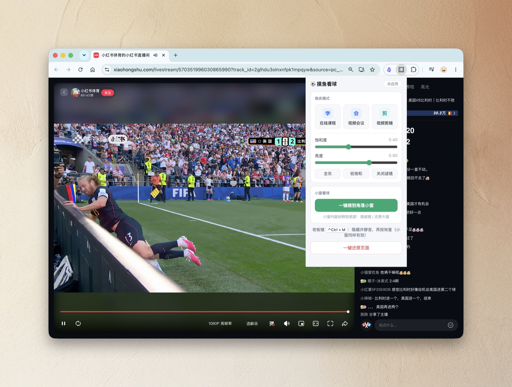
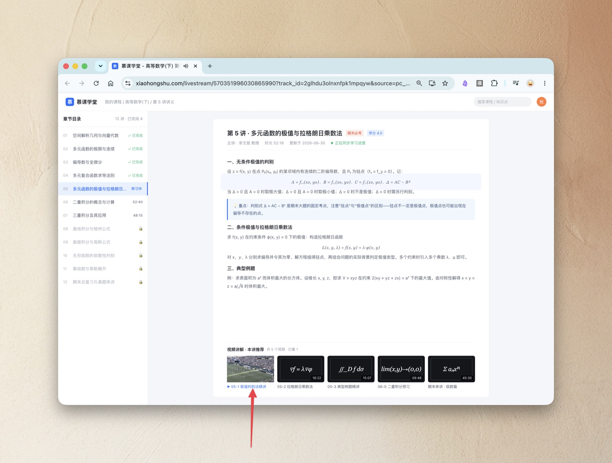
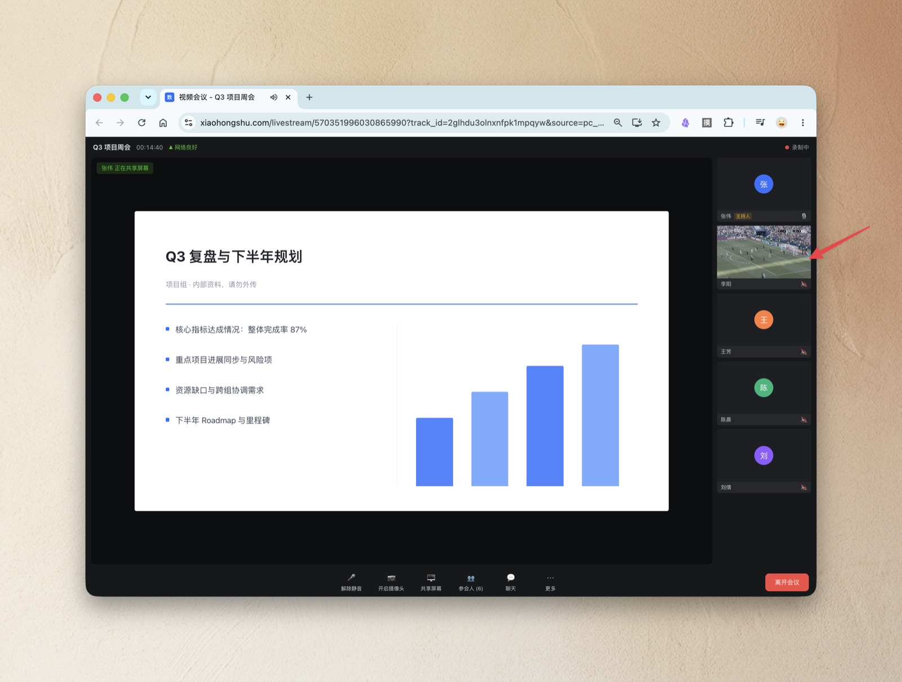
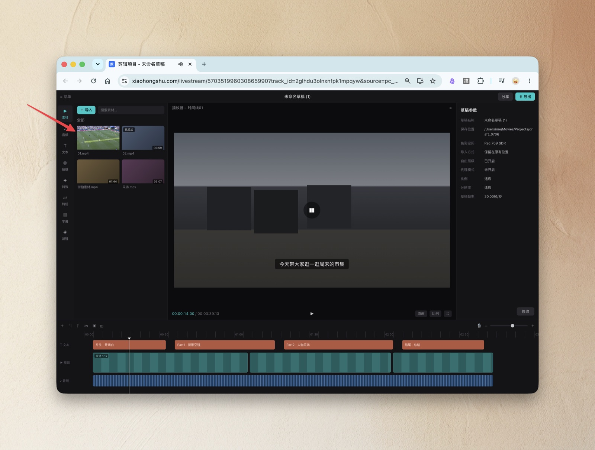
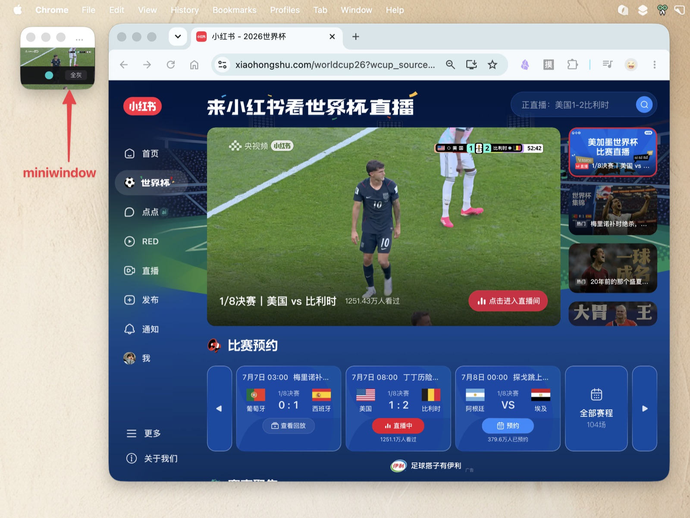

# 🫥 摸鱼隐身衣 Moyu Invisible

[English](README.en.md) | 中文

把任何正在播视频的网页，一键伪装成一个"我在认真工作"的页面。Chrome 插件（Manifest V3），纯 CSS/DOM 层换装：**不代理、不嵌入、不缓存任何流媒体，不碰视频流**。

起因是 2026 世界杯白天有比赛、人在工位——但它不挑内容：小红书直播、B站、腾讯视频、抖音网页版，只要页面里有个在播的 `<video>`，都能换装。



## 三种伪装皮肤

**① 在线课程**（学生党人设）——整页是高等数学讲义，直播流被缩成文末"推荐视频"的第一格（红色箭头处），旁边是黑板公式假封面：



**② 视频会议**（打工人人设）——主屏是共享 PPT，直播流伪装成右侧参会人「李阳」的摄像头小窗（红色箭头处），会议时长真实走秒：



**③ 视频剪辑**（内容岗人设）——剪映风深色界面，直播流是左上角素材区的缩略图（红色箭头处），底部时间轴播放头缓慢移动：



## 小窗看球

一键把当前标签页搬进角落小窗：无标签栏/工具栏，**能缩得比 Chrome 普通窗口的最小尺寸（约 500px 宽）小得多**，视频自动铺满 + 滤镜自动挂上，丢到屏幕角落边干活边看：



## 安装

1. 下载本仓库（`git clone` 或 Code → Download ZIP 解压）
2. Chrome 打开 `chrome://extensions`，右上角开启「开发者模式」
3. 点「加载已解压的扩展程序」，选择本目录

> 偷懒版：把仓库地址直接丢给你的 AI（Claude Code / Codex 等），说一句「克隆下来并告诉我怎么在 Chrome 里加载」。

## 使用

1. 在直播/视频页**先开始播放**，点击插件图标
2. **换皮模式**（三选一）：在线课程 / 视频会议 / 视频剪辑。滤镜滑块和预设（全灰 / 低饱和 / 关闭）就在换皮卡片里，不换皮直接调也会作用于原网页视频
3. **小窗看球**：一键搬进角落小窗 + 铺满 + 滤镜。小窗内鼠标移到窗口底部浮现悬浮条：调滤镜 / **⤢ 还原大窗**
4. **老板键 `Ctrl+M`**（Mac 为 `⌃Control+M`）：一键隐藏视频 + 静音（tab 级静音），再按恢复；换皮和小窗下都有效。这是唯一的快捷键；`suggested_key` 只在首次安装时生效，已装用户可在 `chrome://extensions/shortcuts` 手动绑定
5. **标题伪装**：tab 标题和 favicon 一起换掉（课程皮→「慕课学堂」等），站点脚本改回来会被 MutationObserver 持续覆盖
6. **信息流站点**（B站/抖音网页版等）：切换视频时看门狗 0.6s 内自动跟随接管新视频；竖屏 3:4 视频在皮肤插槽里居中裁切，在小窗里完整显示加黑边
7. 「一键还原页面」恢复原始状态，播放不中断

## 本地测试

```bash
python3 -m http.server 8791
```

- `test/fake-live.html` — 假直播页（canvas 生成球赛画面 + 周期性篡改 title），测插件全流程
- `test/skin-preview.html?skin=course|meeting|editor` — 皮肤视觉预览（不依赖插件）
- `test/e2e-sim.html` — 复刻小红书页面结构（全屏蒙层 + transform 模态）的端到端仿真页，配 chrome API 垫片驱动真实 injector

## 目录结构

```
moyu-invisible/
├── manifest.json          # MV3，权限仅 activeTab / scripting / storage + commands
├── background.js          # 老板键 + tab 级静音 + 小窗切换
├── popup/                 # 插件面板
├── content/
│   ├── injector.js        # 核心：视频识别、皮肤挂载、祖先链提权、看门狗、还原
│   ├── filter.js          # CSS filter 滤镜层
│   ├── disguise.js        # title/favicon 伪装守护
│   └── skins/             # 皮肤（配置驱动，新皮肤 = 新配置文件）
└── test/                  # 本地测试页
```

## 实现要点

- **视频定位**：皮肤 HTML 留一个插槽元素，挂载后读插槽 `getBoundingClientRect()`，把真实视频元素 `position:fixed !important` 精确压在插槽上方（z-index 比假界面高 1），resize 自动重排
- **祖先链提权 + 透明化**：播放器容器常带 `transform`/`filter`（如小红书），会让 fixed 失效且把视频困在低层级的层叠上下文里。启用时中和祖先链上这些属性、抬高 z-index、祖先自身透明化（背景/边框/伪元素清空），并把祖先链之外的兄弟节点 `visibility:hidden`；还原时全部恢复
- **看门狗**：600ms 轮询复位视频位置与滤镜（对抗站点脚本改写 style）；video 被销毁重建或信息流切换时自动重新识别接管
- **小窗**：Chrome 普通窗口有最小尺寸死限，popup 类型窗口没有工具栏能缩更小；用 `chrome.windows.create({type:'popup'})` 把标签页搬进去

## 已知限制

- 播放器自带控件被视频自身覆盖，暂停/音量在进入伪装前调好
- 视频识别失败只报提示，未做手动框选（P1）

## 免责声明

本插件仅为前端界面演示工具，不获取、代理、缓存任何流媒体内容。摸鱼有风险，绩效自负责。
